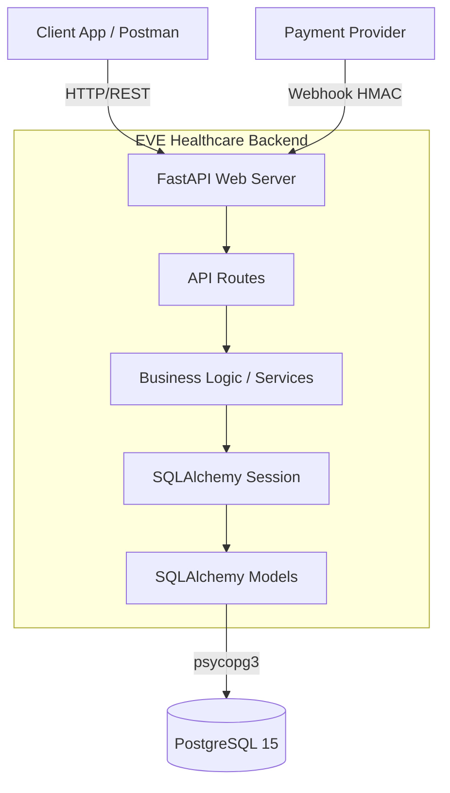
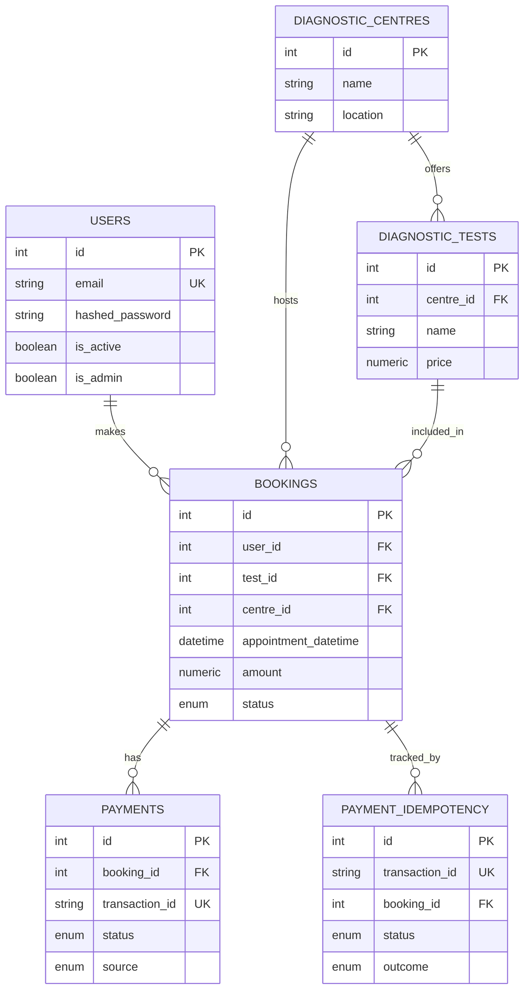
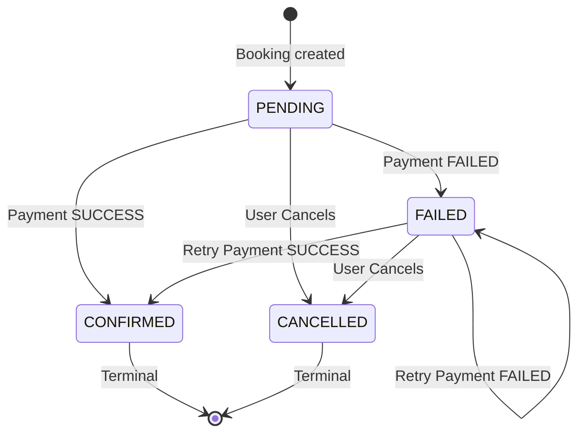

# EVE Healthcare Backend API

A robust, production-ready backend service for diagnostic test bookings and simulated payments, built for EVE Healthcare.

## Overview
This service provides a RESTful API for managing diagnostic centres, booking tests, and handling payment flows via a simulated gateway and an idempotent webhook. It is built using Python 3.12, FastAPI, and PostgreSQL 15, prioritizing code quality, edge-case handling, and architectural clarity.

## Architecture



### Layered Structure
- `app/api/routes`: Thin controllers handling HTTP requests and responses.
- `app/services`: Core business logic, database transactions, and state machine transitions.
- `app/models`: SQLAlchemy ORM definitions mapping to PostgreSQL tables.
- `app/schemas`: Pydantic models for request validation and response serialization.
- `app/core`: Configuration, JWT security, and system dependencies.

## Prerequisites
- **Docker** and **Docker Compose** installed on your system.
- Make (optional, can run `docker-compose` commands directly).

## Setup & Running Locally

1. **Environment Variables**
   Copy the example environment file:
   ```bash
   cp .env.example .env
   ```

2. **Start the Services**
   Build and start the application and database containers:
   ```bash
   docker-compose up --build -d
   ```
   *The FastAPI application will wait for the PostgreSQL database to be healthy before starting.*

3. **Database Migrations**
   Initialize the database schema using Alembic:
   ```bash
   docker-compose run --rm web alembic upgrade head
   ```

4. **Seed Initial Data**
   Create the default Admin user (`admin@evehealthcare.com` / `AdminStrongPass1!`):
   ```bash
   docker-compose run --rm web python scripts/seed.py
   ```

The API will now be available at `http://localhost:8000`. You can view the interactive Swagger documentation at `http://localhost:8000/docs`.

## Running Tests & Linters
Tests are run inside the Docker container against an isolated `eve_test` database.
```bash
# Run the test suite (pytest)
docker-compose run --rm web pytest -q

# Run linters and type checkers
docker-compose run --rm web ruff check app tests
docker-compose run --rm web mypy app tests
```

## Database Entity-Relationship (ER) Diagram



## Booking State Machine



## API Endpoints

| Method | Path | Auth Required | Description |
|--------|------|---------------|-------------|
| POST | `/auth/signup` | No | Register a new user |
| POST | `/auth/login` | No | Get JWT access token |
| GET | `/centres/` | No | List diagnostic centres |
| POST | `/centres/` | Admin | Create a diagnostic centre |
| GET | `/centres/{id}/tests` | No | List tests for a centre |
| POST | `/centres/{id}/tests` | Admin | Add a test to a centre |
| POST | `/bookings/` | Yes | Book a diagnostic test |
| GET | `/bookings/` | Yes | List user's bookings |
| GET | `/bookings/{id}`| Yes | Get specific booking details |
| POST | `/bookings/{id}/cancel` | Yes | Cancel a booking |
| POST | `/payments/` | Yes | Simulate payment process |
| POST | `/payments/webhook/`| HMAC | Idempotent payment webhook |

## Example cURL Requests

**1. Signup**
```bash
curl -X POST "http://localhost:8000/auth/signup" -H "Content-Type: application/json" -d '{"email":"patient@example.com","password":"Password123!"}'
```

**2. Login (Get Token)**
```bash
curl -X POST "http://localhost:8000/auth/login" -H "Content-Type: application/x-www-form-urlencoded" -d "username=patient@example.com&password=Password123!"
```
*(Export the returned token to a variable for subsequent requests: `export TOKEN="your.jwt.token"`)*

**3. List Centres**
```bash
curl "http://localhost:8000/centres/?limit=10&offset=0"
```

**4. Create a Booking**
```bash
curl -X POST "http://localhost:8000/bookings/" -H "Authorization: Bearer $TOKEN" -H "Content-Type: application/json" -d '{"centre_id": 1, "test_id": 1, "appointment_datetime": "2026-11-01T10:00:00Z"}'
```

**5. Simulate Payment**
```bash
curl -X POST "http://localhost:8000/payments/" -H "Authorization: Bearer $TOKEN" -H "Content-Type: application/json" -d '{"booking_id": 1, "payment_method": "CARD"}'
```

**6. Webhook (Valid Signature)**
You can generate the required `X-Webhook-Signature` using OpenSSL:
```bash
PAYLOAD='{"transaction_id": "txn-abc-123", "booking_id": 1, "status": "SUCCESS"}'
SECRET="webhook-secret-change-me-in-production"
SIG=$(echo -n "$PAYLOAD" | openssl dgst -sha256 -hmac "$SECRET" | awk '{print $2}')

curl -X POST "http://localhost:8000/payments/webhook/" -H "Content-Type: application/json" -H "X-Webhook-Signature: $SIG" -d "$PAYLOAD"
```

**7. Webhook (Duplicate Idempotency Demo)**
If you run the exact same Webhook request from Step 6 again, you will receive a 200 OK with:
```json
{"result": "duplicate"}
```

**8. Webhook (State Regression Ignore Demo)**
If you cancel a booking, and then a delayed webhook arrives indicating `SUCCESS`:
```json
{"result": "ignored", "reason": "Booking status transition not allowed: CANCELLED -> CONFIRMED"}
```

## Design Decisions
1. **Idempotency Strategy:** Idempotency is guaranteed at the database level using a unique constraint on `PaymentIdempotency.transaction_id`. Before making any booking updates, the webhook attempts a fast-path check, then locks the booking row (`SELECT FOR UPDATE`), and verifies the constraint again within the transaction.
2. **State Machine:** Booking transitions are centralized in a pure function to strictly enforce business rules. An illegal transition (like FAILED -> CANCELLED -> SUCCESS) is safely rejected without breaking the app.
3. **Synchronous SQLAlchemy:** Selected for simplicity and proven reliability with `psycopg3`. Heavy concurrent writes (like webhooks) rely on database-level row locks rather than complex async locking mechanisms.
4. **Retry Handling:** If a transient database error occurs during the webhook execution, the API returns a `500/503` so the external payment provider can safely retry the delivery.

## Assumptions Made
- No refunds logic is implemented.
- The system operates in a single currency (Amount stored as a decimal without explicit currency tagging).
- Payment methods (card details) are simulated and deliberately NOT stored in the database.
- Finding existing duplicate accounts upon signup returns a 409 by design (a security trade-off for usability).
- Rate limits are stored in-memory (per process) due to the absence of a Redis requirement.

## Future Improvements
- **Redis Integration:** Offload rate-limiting and JWT token blocklisting to a shared Redis instance.
- **Celery / Outbox Pattern:** Implement a background worker to handle outgoing communications and retry failed webhooks gracefully.
- **Webhook Replay Protection:** Include and validate a `timestamp` field in the webhook payload to prevent replay attacks outside of a given time window.
- **Refresh Tokens:** Implement secure HTTP-only cookies for short-lived access tokens and long-lived refresh tokens.
- **RBAC (Role-Based Access Control):** Expand beyond simple `is_admin` flags into distinct permission scopes.
- **Optimistic Locking:** Add a `version` column to the `Booking` model to handle extreme concurrency without relying entirely on pessimistic database row locks.
